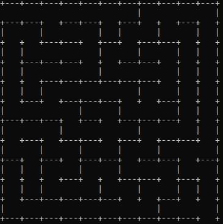

# MazeDFS
Program generating square maze using Randomized Depth-First Search algorithm.

Example of generated maze:

Materials used:

https://en.wikipedia.org/wiki/Maze_generation_algorithm

https://www.algosome.com/articles/maze-generation-depth-first.html

